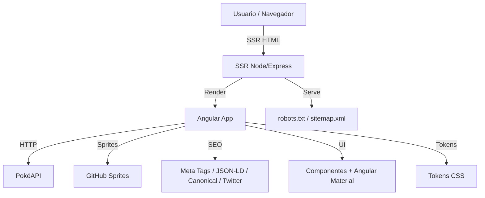

# RedeDor Pokédex

Aplicação Angular 17 com SSR que consome a PokéAPI para listar Pokémon com paginação, filtros por nome e tipo, e uma tela de detalhes com informações completas.

## Visão geral da solução
- **Lista de Pokémon** com filtros (nome e tipo), paginação e estados de loading/erro.
- **Detalhes do Pokémon** com estatísticas, habilidades, altura e peso.
- **SSR + SEO**: metatags dinâmicas por rota (`title`, `description`, `og:*`) e renderização no servidor.
- **Acessibilidade**: `aria-labels`, skip link e foco claro nas interações.
- **Responsivo**: layout fluido, grid adaptativo e breakpoints.
- **UI**: Angular Material + tema customizado (SCSS) e tipografia própria.

### Diagrama simples de arquitetura



## Tecnologias
- Angular 17 (Standalone + SSR)
- Angular Material
- TypeScript
- RxJS
- SCSS (Sass)
- HTML5 / CSS3
- PokéAPI (origem dos dados)
- Karma + Jasmine (testes)
- ESLint (lint de TypeScript/HTML)
- Stylelint (lint de SCSS)

## Tokens de estilo
Os estilos foram padronizados com **tokens CSS**:
- `src/styles/_tokens.scss` (tokens globais: cores, sombras, radius, spacing).
- `src/styles/_page-tokens.scss` (tokens específicos de páginas: lista e detalhe).

Isso permite manter consistência visual e facilita ajustes globais sem refatorar múltiplos arquivos.

## Tokens: CSS vars vs Sass vars
**`var(--page-background)` (CSS custom property)**  
- Valor em **runtime** (pode mudar sem rebuild).
- Útil para temas dinâmicos (claro/escuro) e ajustes por usuário.
- Funciona bem com SSR, hidratação e overrides por componente.

**`$page-background` (Sass variable)**  
- Valor em **build time** (vira fixo no CSS final).
- Útil para cálculos Sass e composições internas.


## SPA x SSR (explicação rápida)
**SPA (Single Page Application)**  
Toda a aplicação é renderizada no navegador. Após o primeiro carregamento, a navegação acontece sem recarregar a página inteira. É ótimo para experiência fluida, mas pode ter impacto em SEO se não houver renderização no servidor.

**SSR (Server-Side Rendering)**  
O servidor gera o HTML da página antes de enviá-lo ao navegador. Isso melhora o tempo de primeira renderização e SEO, pois os motores de busca recebem conteúdo já pronto. Depois, o Angular “hidrata” a página no cliente para torná-la interativa.

## Como funciona
### Dados
Os dados são obtidos da **PokéAPI**:
- `/pokemon?limit=2000&offset=0` para obter a lista completa.
- `/type` para listar tipos.
- `/type/:type` para filtrar por tipo.
- `/pokemon/:id` para detalhes.
- `/pokemon-species/:id` para descrição (flavor text).

Na lista, as imagens são carregadas via **sprites públicos** (sem chamadas extras de detalhe):
- `https://raw.githubusercontent.com/PokeAPI/sprites/master/sprites/pokemon/other/official-artwork/{id}.png`

**Por que foi feito**  
Evita chamadas individuais para cada Pokémon na listagem. O carregamento fica mais leve e rápido porque fazemos apenas **uma chamada** para a lista e deixamos o navegador carregar as imagens diretamente.

**Origem dos IDs dos sprites**  
O endpoint de lista da PokéAPI retorna `name` e `url`. Essa URL contém o ID do Pokémon (ex.: `.../pokemon/25/`).  
Extraímos esse número para montar a URL do sprite oficial.

O serviço `PokeApiService` mantém **cache em memória** para:
- lista completa,
- lista por tipo,
- detalhes por id/nome.

**Quando `/pokemon?limit=2000` é chamado**  
Esse endpoint é chamado no **primeiro carregamento da lista** e sempre que o filtro de tipo está em **“Todos”**.  
Depois da primeira resposta, o resultado fica em cache no `PokeApiService`, evitando novas chamadas na mesma sessão.

### Filtros e paginação
O filtro por nome é local (client-side) em cima da lista recuperada.  
A paginação é aplicada sobre o resultado filtrado.

### SEO/SSR
As páginas atualizam metatags e dados estruturados no `ngOnInit`:
- `title`
- `meta description`
- `og:title`, `og:description`, `og:image` e `og:url`
- `twitter:card`, `twitter:title`, `twitter:description`, `twitter:image`
- `link rel="canonical"`
- JSON-LD simples (ItemList na lista e Thing no detalhe)

O SEO foi centralizado em:
- `src/app/seo/seo-tags.ts` (templates de tags)
- `src/app/seo/seo-routes.ts` (enum de rotas SEO)
- `src/app/seo/seo.service.ts` (aplica `Title`, `Meta`, canonical e JSON-LD)
- `src/app/seo/seo.tokens.ts` (token para URL base no SSR)

Rotas SSR também servem:
- `/robots.txt`
- `/sitemap.xml`

**Detalhes dos ajustes de SEO**
- **Canonical + Twitter Cards**: o `SeoService` agora gera `link rel="canonical"` e as tags `twitter:*` com base nas informações de cada rota. Isso evita duplicidade de conteúdo e garante previews completos quando a URL é compartilhada.
- **Outras redes**: Open Graph (`og:*`) cobre Facebook, LinkedIn, WhatsApp, Telegram e outras. O uso de Twitter Cards foi incluído como **exemplo**, e o mesmo padrão pode ser estendido para outras plataformas.
- **JSON‑LD nas páginas**: a lista injeta `ItemList` (com posição, nome e URL dos Pokémon) e o detalhe injeta `Thing` (com nome, descrição, imagem e identificador). Isso melhora a interpretação semântica pelos mecanismos de busca.

Exemplo do detalhe com URL do projeto e dados do Pokemon:
```html
<script type="application/ld+json">
{
  "@context": "https://schema.org",
  "@type": "Thing",
  "name": "Pikachu",
  "description": "Detalhes, estatisticas e habilidades do Pokemon Pikachu.",
  "image": "https://raw.githubusercontent.com/PokeAPI/sprites/master/sprites/pokemon/other/official-artwork/25.png",
  "url": "https://pokemon-rededor.com/pokemon/25"
}
</script>
```
- **`sitemap.xml` e `robots.txt` via SSR**: o `server.ts` serve esses endpoints diretamente no Node, facilitando indexação e rastreamento. O sitemap inclui a home e pode ser expandido para outras rotas.

**Canonical**  
Canonical define a URL oficial da pagina para buscadores.  
Exemplo:
```html
<link rel="canonical" href="https://meusite.com/pokemon/25">
```
Se a mesma pagina puder aparecer em URLs diferentes (ex.: com filtros), o canonical evita duplicacao e concentra o SEO em uma unica URL.


**Debug no console (via switch)**  
O `SeoService` imprime no console as tags geradas e o JSON‑LD quando o toggle **SEO Debug** esta ativo.  
O switch ativa `localStorage` com `seo_debug=1` e funciona em dev e em producao.

## Estrutura principal
- `src/app/services/poke-api.service.ts`
- `src/app/pages/pokemon-list/`
- `src/app/pages/pokemon-detail/`
- `src/app/utils/pokemon-types.ts`
- `src/styles.scss`

## Rodando o projeto
### Dev (CSR)
```bash
cd pokemon-rededor
npm start
```
Acesse `http://localhost:4200`.

### SSR local
```bash
cd pokemon-rededor
npm run build
npm run serve:ssr:pokemon-rededor
```
O servidor SSR também escuta em `http://localhost:4000` (padrão do Angular SSR).

## Testes
```bash
cd pokemon-rededor
npm test
```
Inclui testes de:
- `PokeApiService` (cache e filtros)
- UI básica dos componentes de lista e detalhe
- snapshots simples de SEO (título e metatags)

## Lint
```bash
cd pokemon-rededor
npm run lint
npm run lint:styles
npm run lint:all
```
`lint` valida TypeScript e templates Angular.  
`lint:styles` valida os arquivos SCSS.  
`lint:all` roda ambos em sequência.

## Requisitos atendidos
- Angular 17+ com SSR
- JavaScript/TypeScript
- CSS/SCSS
- Responsividade
- Acessibilidade
- Usabilidade
- SEO

## Observações
- A imagem do Pokémon usa o artwork oficial quando disponível, com fallback local em `assets/pokemon-placeholder.svg`.
- O layout foi feito com Angular Material e tema customizado.
